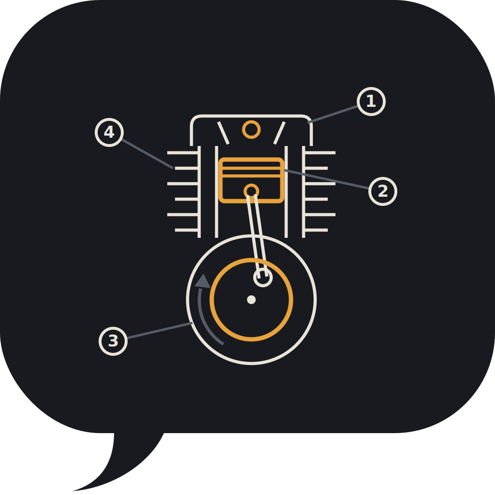
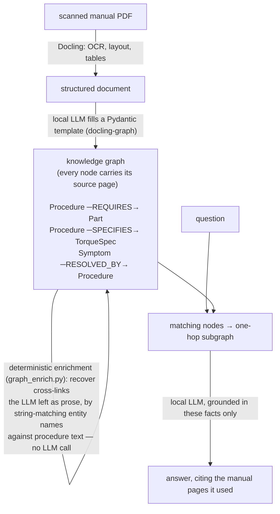

<p align="center">
  
</p>

# Torque to Me

[](https://github.com/slopespe/torque-to-me/actions/workflows/ci.yml)
[](CHANGELOG.md)
[](pyproject.toml)
[](LICENSE)
[-orange)](https://ollama.com)

A maintenance assistant for old motorcycles, built from their scanned
service manuals with [docling-graph](https://github.com/docling-project/docling-graph).
Upload your own manual, get a knowledge graph, ask questions. Every answer
is grounded with page-level provenance back to the manual. Runs fully
local with Ollama: your manual never leaves your machine.

Works with any bike whose service manual you have as a PDF. Built and
tested on a 1990s Honda NX650 Dominator — the graph it produced ships in
[`examples/honda-nx650/`](examples/honda-nx650/), so you can try the
query layer and the app before extracting anything yourself.

Design rationale lives in [`docs/architecture.md`](docs/architecture.md);
release history in [`CHANGELOG.md`](CHANGELOG.md).

## How it works



The enrichment step exists because small local models extract entities and
step text faithfully but tend to leave the *relational* fields empty — the
step says "Crankcase drain plug torque: 25 N·m" while the procedure's
torque_specs list stays `[]`. Since both endpoints already exist as nodes,
plain string matching recovers the edges for free. LLM for reading, plain
code for linking, human spot-checks as the final gate.

## Hardware requirements

- Python 3.10, 3.11 or 3.12
- 16 GB RAM minimum (32 GB comfortable)
- GPU with 8+ GB VRAM recommended. CPU-only works but extraction is slow.
- ~15 GB disk for models

## Setup

### 1. Install Ollama and pull the models

The pipeline uses two models: a strong (usually thinking) model to build
the knowledge graph, and a fast model with thinking disabled to answer
questions — answers come in seconds instead of the minutes a thinking
model spends reasoning.

```bash
# Linux
curl -fsSL https://ollama.com/install.sh | sh
# Windows/macOS: download from https://ollama.com/download

# Answer model (fast; thinking turned off via config.toml):
ollama pull gemma4:12b  # ~7.6 GB
# ...or gemma3:12b (~8 GB), which has no thinking mode at all

# Extraction model — pick ONE based on your hardware:
ollama pull qwen3:30b   # best quality on 24 GB+ unified memory (MoE, ~19 GB)
ollama pull qwen3:14b   # strong middle ground, ~9 GB
ollama pull qwen3:8b    # lighter machines, ~5 GB

ollama run gemma4:12b "Say ok"   # verify
```

Already have a model you like (including thinking models such as qwen3
or qwen3.5)? It probably works — but read
[Running on local thinking models](#running-on-local-thinking-models-lessons-learned)
first: Ollama's default context window will silently break extraction
unless you raise it.

### 2. Create the Python environment

```bash
cd torque-to-me
python -m venv .venv
source .venv/bin/activate        # Windows: .venv\Scripts\activate
pip install -e .                 # contributors: pip install -e ".[dev]"
```

This installs the `torque` command used everywhere below. First run of
docling downloads its layout/OCR models (~500 MB).

### 3. Configure (optional)

All settings live in `config.toml` — which model answers questions,
which one builds graphs, thinking mode, context window, timeouts. The
file is looked up in the directory you run `torque` from (the repo root,
normally). Every key is optional (defaults are in
`torque_to_me/config.py`), CLI flags override the file, and
`TORQUE_TO_ME_CONFIG=/path/to/file` points at an alternative config.

```toml
[answer]
model = "gemma4:12b"
think = false        # true = better but minutes-slow answers

[extract]
model = "qwen3.5-32k"
```

### 4. Prepare your manual

Do NOT feed the whole manual on the first run. Cut out one chapter, ideally
the maintenance chapter with the torque tables:

```bash
torque split data/input/manual.pdf --pages 20-45 \
    --output data/input/chapter_maintenance.pdf
```

Find the page range in the manual's table of contents.

## Two ways to use it

### Easy path: the app

```bash
torque app    # models come from config.toml; or just ./demo.sh
# open http://localhost:7860
```

- **"Your manual" tab**: upload the chapter PDF, name the bike, click
  "Build knowledge graph". Extraction takes minutes to tens of minutes.
- **"Torque to me" tab**: pick the bike, ask away. The right panel shows
  the graph facts and manual pages behind each answer.

Multiple bikes coexist: each gets its own graph under `outputs/<bike-tag>/`.

### Full-control path: the CLI

Run in order; each stage has a quality gate.

**Stage 1 — Conversion check**

```bash
torque check data/input/chapter_maintenance.pdf
```

Writes `outputs/conversion_preview.md`. **Gate:** torque tables must
survive as tables and numbers must be readable. If mangled, get a better
scan or try `pip install "docling-graph[vlm]"` and the VLM backend.
Nothing downstream recovers from bad conversion.

**Stage 2 — Extraction**

```bash
torque extract data/input/chapter_maintenance.pdf \
    --model qwen3.5-32k --tag honda-nx650
```

Saves under `outputs/honda-nx650/`: `graph.pickle` (the graph),
`models.json` (raw extracted objects), `extraction_report.txt` (counts
and sample provenance). **Gate:** pick 10 facts from `models.json` and
check them against the paper manual. Target 9/10. If quality is poor,
improve the `description=` strings in
`torque_to_me/templates/service_manual.py` (they are the extraction
instructions the LLM sees), try a larger model, or narrow the page range.

Alternative: induce a template from your own manual instead of using
the shipped one:

```bash
docling-graph template from-docs data/input/chapter_maintenance.pdf \
    --output my_bike_template.py --name ServiceManualChapter --trial-run
```

**Stage 3 — Query from the terminal**

```bash
torque query "torque for the rear axle nut" --tag honda-nx650
torque query "engine runs rich at idle" --show-facts
```

(`--tag` optional when only one graph exists.)

**Stage 4 — Visualize the graph**

```bash
torque viz --tag honda-nx650
# open outputs/honda-nx650/graph.html
```

Interactive, color-coded by entity type. Hover a node to see its
attributes and source page.

**Optional Stage 5 — Curate**

The demo graph in this repo went through one more pass: `torque
curate-demo` encodes what a careful human reading of the converted
manual recovers that the LLM missed (whole procedures, the recommended
oil spec, symptom→fix links). It is specific to the NX650 lubrication
chapter, but it shows the pattern: curated nodes carry `match='curated'`
provenance so they stay distinguishable, and the command is idempotent
so it can re-run after every extraction. (`torque enrich` re-runs just
the deterministic cross-link recovery, which `torque extract` already
does automatically.)

## Running on local thinking models: lessons learned

This pipeline was debugged end-to-end against `qwen3.5` (a 10B thinking
model) on a Mac. Everything below looked like "the LLM returns empty
output" — each had a different cause. If you run a thinking model
locally, you will likely meet all three:

**1. Ollama's default context window silently truncates your prompts.**
Ollama runs models with a 4096-token context unless told otherwise — even
if the model supports 262k. Extraction prompts are 8–10k tokens, so the
prompt got cut to 4095 tokens and generation stopped after 1 token
(`prompt_tokens=4095, completion_tokens=1, finish_reason=length`). Fix:
create a derived model with a bigger context — instant and free, it
reuses the existing weights:

```bash
printf 'FROM qwen3.5:latest\nPARAMETER num_ctx 32768\n' > Modelfile
ollama create qwen3.5-32k -f Modelfile
# then use --model qwen3.5-32k everywhere
```

**2. Thinking models return empty content on LiteLLM's legacy `ollama/`
route.** The `ollama/` prefix uses the generate endpoint, which does not
separate reasoning from the answer — content comes back empty. The
`ollama_chat/` route separates them correctly. This repo sets
`provider_override: "ollama_chat"` in the pipeline config for that reason.

**3. Parallel workers against a serial server snowball into timeouts.**
Ollama processes one request at a time; N parallel extraction workers
just means N−1 requests queue until their timeout expires, then retry
into the same queue. One run's ETA grew past 2 hours before being killed.
This repo sets `parallel_workers: 1` with a 900 s timeout — sequential is
genuinely the fastest configuration for a single local model. Budget for
generous timeouts generally: a thinking model can reason for minutes
before emitting its first answer token.

Expect roughly 40 minutes per manual chapter for extraction on a laptop
with a 10B thinking model. Querying the finished graph takes seconds.

## A word of caution

Extraction is good but not perfect. Spot-check torque values against the
paper manual before putting a wrench on your actual bike. The provenance
on every answer exists precisely so you can verify in seconds.

## Troubleshooting

| Problem | Fix |
|---|---|
| Ollama connection refused | `ollama serve` must be running; check `curl http://localhost:11434` |
| "LiteLLM returned empty content" | Almost always the context window or the thinking-model route — see [lessons learned](#running-on-local-thinking-models-lessons-learned) |
| Extraction returns empty models | Model too small or chunk too large: try 14b, or a smaller page range |
| LLM calls time out | Thinking models reason for minutes; keep `parallel_workers: 1` and raise `timeout_s` |
| OCR garbage in conversion | Better scan, VLM extra, or pre-process the PDF (deskew, contrast) |
| `docling-graph` config key errors | Config keys move between versions; this repo pins `>=1.9,<2`. Check `pip show docling-graph` and https://docling-project.github.io/docling-graph/ |
| Out of memory during extraction | Use the 7b model, or a smaller chapter |

## Project layout

```
torque-to-me/
├── README.md
├── pyproject.toml            # packaging, deps, ruff + pytest config
├── config.toml               # model/timeout settings (all optional)
├── demo.sh                   # one-command app launcher
├── torque_to_me/             # the package behind the `torque` CLI
│   ├── cli.py                # argument parsing + subcommand dispatch
│   ├── config.py             # config.toml loading and defaults
│   ├── split_pdf.py          # torque split — cut a chapter out
│   ├── conversion_check.py   # torque check — quality gate 1
│   ├── extract.py            # torque extract — build the graph (--tag)
│   ├── graph_enrich.py       # torque enrich — cross-link recovery (auto-run)
│   ├── curate_demo.py        # torque curate-demo — the human-in-the-loop pass
│   ├── query.py              # torque query — CLI question answering
│   ├── app.py                # torque app — upload, build, ask
│   ├── visualize.py          # torque viz — interactive HTML graph view
│   ├── graph_viz.py          # shared pyvis rendering
│   ├── bike_meta.py          # per-bike metadata + graph path resolution
│   └── templates/
│       └── service_manual.py # extraction schema (bike-agnostic)
├── tests/                    # pure-logic unit tests (no LLM needed)
├── docs/architecture.md      # design rationale
├── examples/honda-nx650/     # a real extracted graph, ready to query
├── data/input/               # your manual PDFs (gitignored)
└── outputs/<bike-tag>/       # one graph per bike (gitignored)
```

No manual is shipped with this repo — service manuals are copyrighted, so
bring your own PDF. Any scanned manual works; scans of 90s manuals OCR
surprisingly well.

## Version note

Written against docling-graph 1.9.x (August 2026), pinned `>=1.9,<2` in
pyproject.toml. Two API notes for future upgrades: `run_pipeline`
returns a `PipelineContext` (1.x behaviour), and the `edge()` field helper
is intentionally *not* importable from the library — docling-graph ships
it as a documented snippet that template authors copy into their template,
which is why it is defined locally in
`torque_to_me/templates/service_manual.py`.
